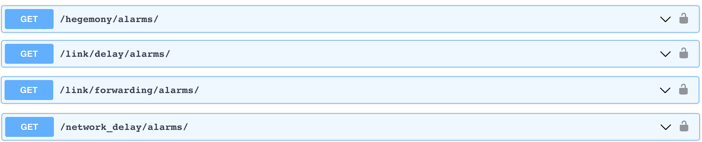
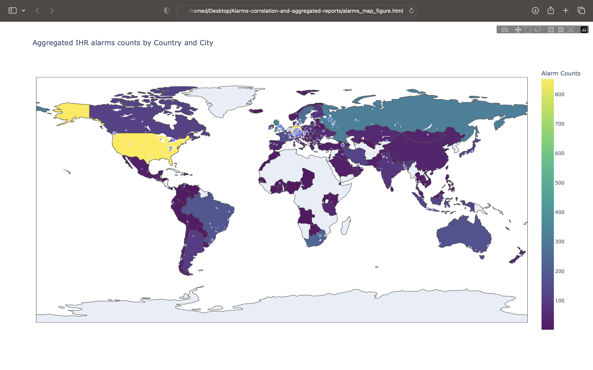

# Alarms Correlation and Aggregated Reports
This is a proof of concept implementation of simple anomaly detectors to identify changes in monitored metrics in IHR. This often results in a lot of alarms being displayed as tables in IHR global reports. The most important events usually generate numerous alarms across multiple datasets. It's an online tool for grouping topologically or geographically related alarms that happen at the same time and providing multi-dimensional reports.

# Project Overview
This project consists of two main components:
1- A JS module to analyze and aggregate alarms
2- A VueJS component to display aggregated alarms

The JS module will be responsible for analyzing alarms and grouping them based on their topological or geographical relation and the time they occurred. The VueJS component will be responsible for displaying the aggregated alarms in a user-friendly manner.

The tool will be integrated with IHR's global report to allow users to quickly access the aggregated alarms directly from the report.

# Data Sources
- [MaxMind](https://dev.maxmind.com/geoip/geolite2-free-geolocation-data?lang=en): Used to obtain geo-location information for IP addresses, ASN, City, and Countries found in the IHR alarms dataset
- [IHR alarms dataset](https://ihr.iijlab.net/ihr/en/api): The alarms dataset was obtained from IHR's API endpoint. The dataset contains various metrics that are monitored by IHR's anomaly detectors. The data is in JSON format and is retrieved using HTTP GET requests.
   

# Installation and Usage

## Prerequisites

## Installation

## Usage

# Screenshoots

# Video Recording

# Live Report
[Live Report](https://mhmdawnallah.github.io/Alarms-correlation-and-aggregated-reports/figures/alarms_map_figure.html)
# Conclusion
This tool provides an easy way to analyze and aggregate alarms in IHR, making it easier to identify important events that generate multiple alarms across multiple datasets. By grouping topologically or geographically related alarms, multi-dimensional reports can be generated that provide a more comprehensive view of the data.
